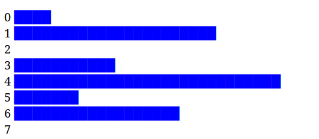
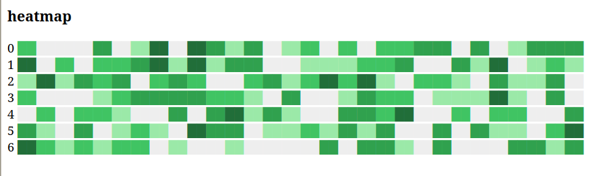
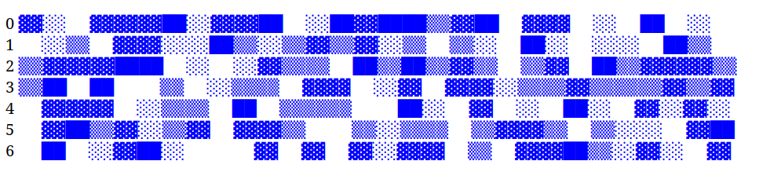

# unicplot

Generate visualizations using Unicode characters directly in your terminal or web browser.

## Installation

```bash
npm install unicplot
```

## Usage

### Bar Plot

Create simple bar plots with custom dimensions:

```javascript
import { BarPlot } from "unicplot";

const barPlot = new BarPlot(100, 30); // width: 100, height: 30
const data = Array(30).fill(0).map(() => Math.floor(Math.random() * 10));
const output = barPlot.render(data);

// Browser
document.querySelector("#barchart").innerHTML = output;

// Node.js
console.log(output);
```

### Histogram

Generate histograms with automatic frequency calculations:

```javascript
import { Histogram } from "unicplot";

const histogram = new Histogram(100, 30);
const data = Array(30).fill(0).map(() => Math.floor(Math.random() * 10));
const output = histogram.render(data);
```

### Heatmap

Create heatmaps with two different styles:

```javascript
import { HeatMap } from "unicplot";

const heatmap = new HeatMap(100, 30);
const data = Array(7).fill().map(() => 
  Array(30).fill(0).map(() => Math.floor(Math.random() * 10))
);

// Gradient-based heatmap
const gradientOutput = heatmap.render(data);

// Pattern-based heatmap
const patternOutput = heatmap.render(data, {
  colorScheme: "blue",
  useSpectrum: false
});
```

### Screenshots



